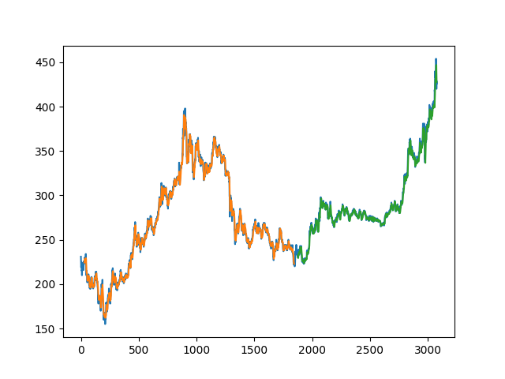
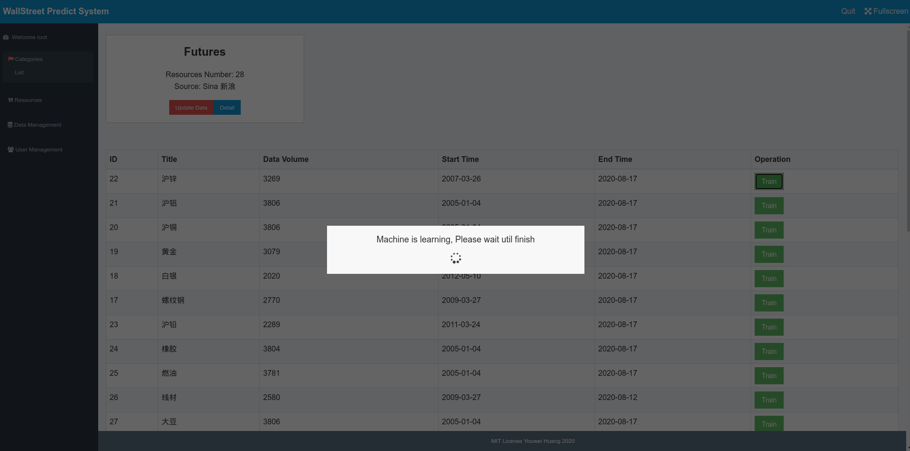
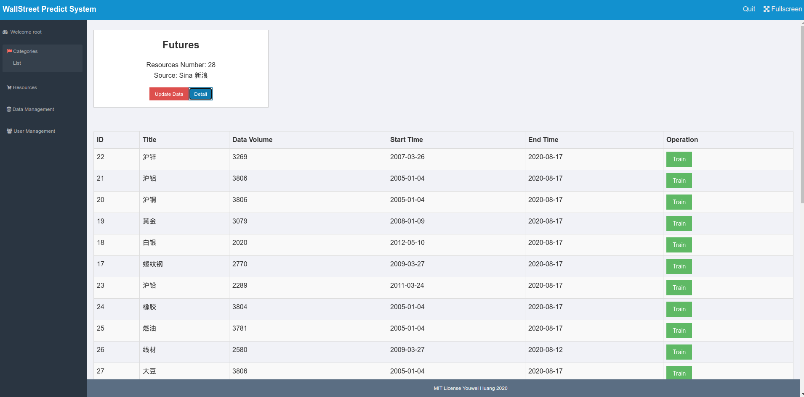
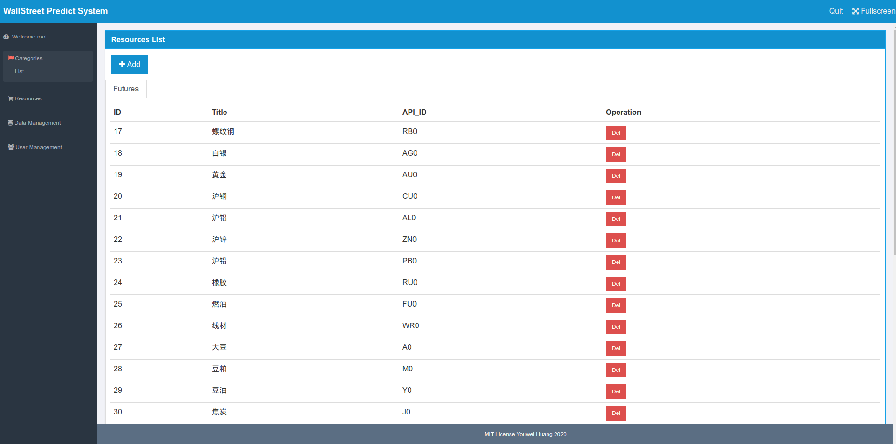
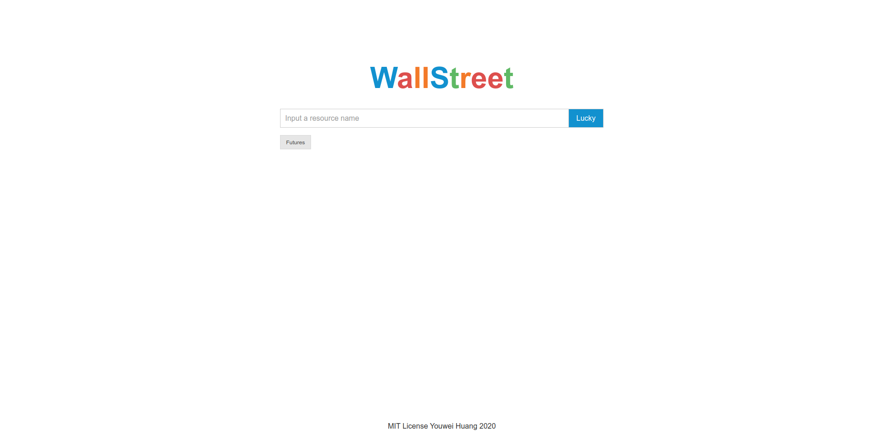
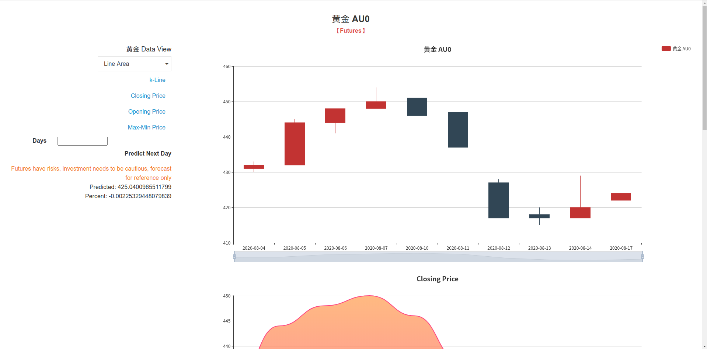

# WallStreet (New)

The new version of wallstreet, In English.

_Predict the futrues in China_

## Deployment

-   MySQL
-   Node.js 9.0+
-   python3
-   pip3

## Quick Start

1. import sql file to MySQL
2. Change your mysql config in dbconfig.json

```

pip3 install -r requirements

npm install

node ./server.js

```

## 后记和发展方向

1. 目前项目运行需要安装 node.js 和 python，同时维护两门语言，过于繁杂，本人正在研究 google 最新发布的 tensorflow.js，尝试使用 JavaScript 统一项目语言
2. 目前只对最高价进行深度学习，未来将考虑加入更多交易参数，学习过程将变复杂，预测结果将更有参考价值
3. 当前只能对期货进行爬虫和预测，未来将加入股票和电商网站实体商品

## Examples












